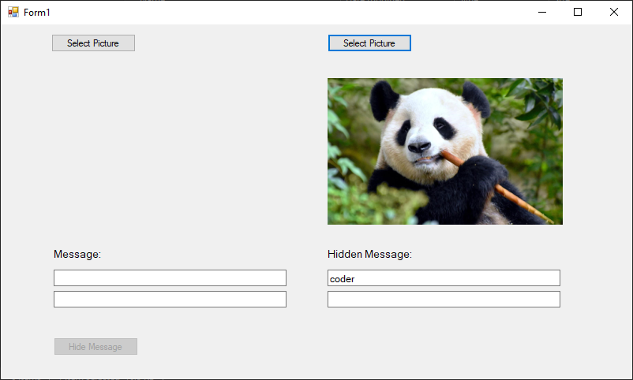

# 🖼️ Steganography Tool - LSB Image Hiding in PNG

## 📌 Giới thiệu

`Steganography.exe` là một ứng dụng WinForms viết bằng C# giúp bạn **giấu và giải mã thông điệp ẩn trong ảnh PNG** sử dụng kỹ thuật **Least Significant Bit (LSB)**. Công cụ này đặc biệt hữu ích cho học tập, nghiên cứu bảo mật hoặc thử nghiệm CTF.

---

## 🧠 Kỹ thuật sử dụng

### 1. ✅ **Kỹ thuật LSB (Least Significant Bit)**

- Kỹ thuật LSB thay đổi **bit cuối (ít quan trọng nhất)** trong giá trị màu (R, G, B) của từng pixel ảnh.
- Mỗi pixel có 3 kênh màu → có thể lưu 3 bit thông tin.
- Ví dụ: 
  - Pixel ban đầu: `(R: 10110110, G: 01101001, B: 11100001)`
  - Sau khi giấu `011`: `(R: 10110110, G: 01101000, B: 11100001)`  
    (Chỉ thay đổi các bit cuối, hình ảnh gần như không đổi).

### 2. 🕵️‍♂️ **Phát hiện ảnh đã bị chỉnh sửa**

- Ứng dụng có thể kiểm tra ảnh PNG **có bị chỉnh sửa hay không** bằng cách phân tích cấu trúc nội dung ảnh.
- **Cơ chế kiểm tra**:
  - Công cụ hoạt động tương tự với các công cụ forensic như `zsteg`.

---

## 🖥️ Giao diện và cách sử dụng

Giao diện chia làm **hai phần chính**:

### 🔹 **BÊN TRÁI: MÃ HÓA THÔNG ĐIỆP**

1. **Chọn ảnh PNG gốc**:  
   - Bấm nút **[Chọn ảnh để hiển thị]** để tải ảnh vào khung bên trái (`PictureBox pb1`).
   - Ảnh giới hạn: tối đa 1366x768, ≤ 500MB.

2. **Nhập thông điệp cần giấu** vào ô văn bản bên dưới (`txt1`):
   - Hỗ trợ giấu ký tự Unicode, tối đa ~3750 byte cho ảnh 100x100.

3. **Nhấn [Hide Message]**:
   - Thông điệp được mã hóa và nhúng vào ảnh thông qua LSB.
   - Hiển thị bảng so sánh **RGB trước và sau khi giấu**.
   - Sau đó, lưu ảnh mới (`LSB.png`) qua hộp thoại Save.

---

### 🔸 **BÊN PHẢI: GIẢI MÃ THÔNG ĐIỆP**

1. **Chọn ảnh nghi ngờ có chứa thông điệp** (`pb2`):
   - Bấm nút **[Chọn ảnh để giải mã]**, chọn file `.png`.

2. **Tự động kiểm tra**:
   - Nếu ảnh **không bị chỉnh sửa** → in ra: `"Ảnh không có giấu tin"`.

3. **Kết quả**:
   - Nội dung ẩn sẽ hiển thị tại khung văn bản `txt2`.

---

## 📂 Yêu cầu hệ thống

- Hệ điều hành: Windows 7/10/11
- .NET Framework ≥ 4.7.2
- Ảnh PNG đúng chuẩn, không bị nén mất thông tin màu

---

## 📎 Ghi chú

- Công cụ hiện không hỗ trợ ảnh `.jpg` do ảnh JPEG sử dụng nén mất dữ liệu (lossy), không phù hợp với LSB.
- Không sử dụng ảnh có chỉnh sửa mạnh (lọc, resize, chỉnh màu) nếu muốn giữ nguyên thông điệp.

---

---

## 📷 Demo

---

## 📜 License

MIT – Free for education and research.
